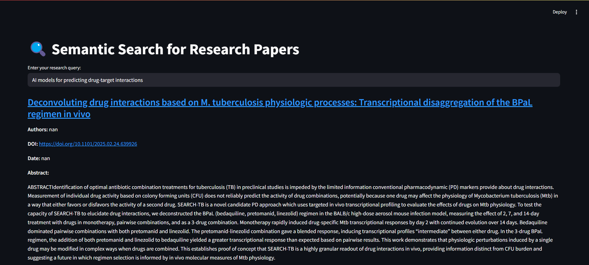

# **GenomicIR-NLP**

This project focuses on showcasing different Natural Language Processing and Artificial Intelligence techniques on the domain of genomics.

It enables researchers, scientists, and students to query genomics literature using natural language and get relevant answers grounded in academic research.

---

## **Features**
- **Web Scraping** of genomics research papers.
- **Storing crawled data** in a data store(database).
- **Summarizing abstracts** of crawled scraped papers.
- **Question Answering Chatbot** using LlaMa-2-7B.
- **Information Retrieval** using all-MiniLM-L6-v2 embedding model.

---

## **Functionalities**

### **Web Scraping**
Research papers are crawled from the [biorxiv genomics website](https://www.biorxiv.org/collection/genomics) using [Beautiful Soup](https://pypi.org/project/beautifulsoup4/) and requests libraries.
The following components of the research papers are stored in a CSV file.
- Title
- Authors
- DOI
- Date
- Paper URL

### **Storing Crawled Data**
The aforementioned details of the crawled research papers are stored in MongoDB database due to its scalability, cloud support and easy use with Python using the [PyMongo](https://pymongo.readthedocs.io/en/stable/) library.
1. A connection is made to the MongoDB client.
2. The database is created.
3. The collection is created.
4. Dataframe containing crawled data is converted to a list of dictionaries.
5. These are inserted into MongoDB.

### **Summarizing Abstracts**
This component crawls the research papers once again and extracts the abstract of the research paper and generates a summary based on it.
1. Crawl the abstract section of the research papers using the URL.
2. Load the [Google T5-small](https://huggingface.co/google-t5/t5-small) model along with its tokenizer.
3. Define a function to encode the text using the tokenizer and generate the summaries using the model.
4. Maximum length of the summary is defined at 150 words.
5. The abstract and the summary are saved along with the Paper URL to a CSV file.

### **Question Answering Chatbot**
This component builds a question answering chatbot which can respond to user queries using the abstracts of the research papers.

#### abstract_crawl.py
This script crawls the abstract of the research papers using Beautiful Soup and saves it to a CSV file.

#### data_ingestion.py
This script uses the crawled abstract and passes them through an embedding model and indexes them into a vector database.
- Embedding model- [BAAI/bge-small-en](https://huggingface.co/BAAI/bge-small-en)
- Vector database- [ChromaDB](https://www.trychroma.com/)

#### retrieval.py
This script retrieves the data stored in the ChromaDB. BM25 keyword search is used to return the top 3 results from the keyword search and the top5 results are obtained from the vector search. The results from both means are combined and reranked using the [CohereReranker](https://pypi.org/project/reranker/) with the help of the [rerank-english-v2.0](https://huggingface.co/Cohere/rerank-english-v2.0)

#### chatbot.py
This script is used to build the chatbot.
1. [LlaMa-2-7b-chat-hf model](https://huggingface.co/meta-llama/Llama-2-7b-chat-hf) is used as the model for this chatbot.
2. The model and its tokenizer are loaded.
3. Token limit is set at 4096 to prevent exceeding input limit of the model.
4. Conversational memory is implemented to keep track of chats.
5. Retrieval Augmented Generation is used and the response is returned.

### **Information Retrieval**
This component produces an interactive Streamlit interface to produce the top research papers on a user specified topic.
1. The [all-MiniLM-L6-v2](https://www.sbert.net/docs/sentence_transformer/pretrained_models.html) embedding model is loaded the documents are embedded.
2. The Faiss index is built using the L2 distance index and the searches return the Title, Authors, DOI, URL, Date, Abstract and Summary of the top five papers.
3. These are presented on an interactive Stramlit interface where the user can enter the query of his choice.

####  Commands to run the interface
1. python prepare_index.py
2. streamlit run streamlit_app.py

#### Interface

---

## Future Developments
1. Use larger and stronger models for the functionalities to improve predictive power.
2. Add citiation references in responses.
3. Incorporate PDF text parsing for deeper context.

---

## License
This project is governed by the MIT license.