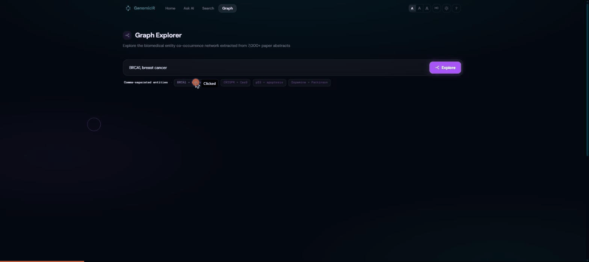
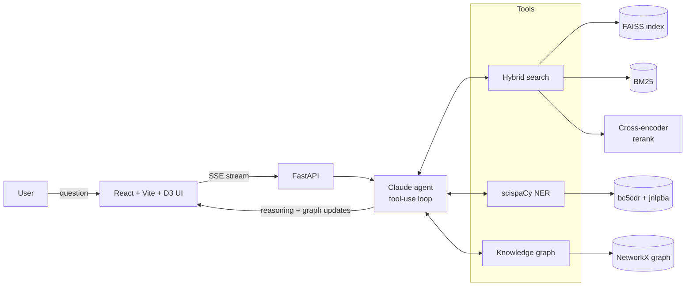

<div align="center">

# 🧬 GenomicIR-NLP

### Agentic GraphRAG over a scientific paper corpus — a template you can point at your own data.

A Claude tool-use agent that hybrid-searches **7,070 bioRxiv genomics papers**, traverses a
biomedical knowledge graph, and streams its reasoning into a live, force-directed D3 visualization.

[](https://github.com/arkhash0309/GenomicIR-NLP/actions/workflows/ci.yml)
[](LICENSE)
[](https://www.python.org/)
[](https://nodejs.org/)
[](CONTRIBUTING.md)

[Quickstart](#-quickstart) · [How it works](#-how-it-works) · [Use your own corpus](#-use-your-own-corpus) · [Configuration](#-configuration) · [Contributing](CONTRIBUTING.md)

</div>

---

> **Why this repo?** Most RAG demos stop at "embed → retrieve → stuff the prompt." This one is a
> complete, production-shaped **agentic GraphRAG** stack: hybrid retrieval with reranking, biomedical
> entity extraction, a knowledge graph the agent can *traverse*, streaming tool-use, and a polished
> UI — all wired so you can swap in **your own** corpus and re-theme it in minutes.

<!--
  📸 DEMO: docs/assets/demo.gif shows the live Graph Explorer building entity co-occurrence
  networks. To add an /ask agent clip or more screenshots, see docs/assets/README.md.
-->
<div align="center">
  
  <p><em>Live Graph Explorer: entity co-occurrence networks (genes · diseases · chemicals) rendered with D3 force layout.</em></p>
</div>

## ✨ Features

- 🤖 **Agentic research assistant** (`/ask`) — a Claude agent with five tools (hybrid search, entity
  extraction, graph lookup, entity connections, paper details). It streams its reasoning trace and
  **builds a live D3 knowledge graph as it thinks**.
- 🔎 **Hybrid search** (`/search`) — FAISS semantic + BM25 lexical, fused with Reciprocal Rank Fusion,
  then reranked by a cross-encoder for top-k precision.
- 🕸️ **Graph explorer** (`/explore`) — browse the entity co-occurrence network of genes, diseases,
  and chemicals and their paper connections.
- 📄 **Paper detail** (`/paper/:id`) — full paper with extracted biomedical entities.
- 🧩 **Template-first** — corpus, models, and framing are environment-driven; bring your own papers.
- 🐳 **One command to run** — `make up` (Docker) or `make backend` + `make frontend` (local).

## 🏗️ Architecture


```mermaid
flowchart LR
    U[User] -->|question| FE[React + Vite + D3 UI]
    FE -->|SSE stream| API[FastAPI]
    API --> AG[Claude agent<br/>tool-use loop]

    subgraph Tools
      HS[Hybrid search]
      NER[scispaCy NER]
      KG[Knowledge graph]
    end

    AG <--> HS
    AG <--> NER
    AG <--> KG

    HS --> FAISS[(FAISS index)]
    HS --> BM25[(BM25)]
    HS --> RR[Cross-encoder<br/>rerank]
    KG --> NX[(NetworkX graph)]
    NER --> SP[(bc5cdr + jnlpba)]

    AG -->|reasoning + graph updates| FE
```

| Layer | Tech |
|---|---|
| Frontend | React 18 · Vite · TailwindCSS · D3.js · Framer Motion |
| Backend | Python 3.11 · FastAPI · Uvicorn · SSE streaming |
| LLM | Anthropic Claude (tool use + streaming) — model configurable |
| Retrieval | FAISS · rank-bm25 · Reciprocal Rank Fusion · `cross-encoder/ms-marco-MiniLM-L-6-v2` |
| NER | scispaCy `en_ner_bc5cdr_md` + `en_ner_jnlpba_md` |
| Knowledge graph | NetworkX (in-memory, built at startup) |

## 🚀 Quickstart

### Prerequisites
- An [Anthropic API key](https://console.anthropic.com/)
- Either **Docker**, or **Python 3.11+** and **Node 18+**

### Option A — Docker (one command)

```bash
git clone https://github.com/arkhash0309/GenomicIR-NLP.git
cd GenomicIR-NLP
cp .env.example .env          # add your ANTHROPIC_API_KEY
make up                       # or: docker compose up --build
```

Frontend → http://localhost:5173 · Backend → http://localhost:8000

### Option B — Local

```bash
cp .env.example .env          # add your ANTHROPIC_API_KEY
make install                  # backend + frontend dependencies

make backend                  # terminal 1 → http://localhost:8000  (first start builds caches)
make frontend                 # terminal 2 → http://localhost:5173
```

> **First start note:** the backend downloads embedding/reranker/NER models and builds an entity
> cache over the corpus (~5 min on first run, then cached in `app/backend/data/entity_cache.json`).
> Want a faster boot? Build a tiny sample corpus first — see [below](#-use-your-own-corpus).

## 🔧 Configuration

Everything is configured through environment variables (see [`.env.example`](.env.example)).
Sensible defaults reproduce the original genomics app out of the box.

| Variable | Default | Description |
|---|---|---|
| `ANTHROPIC_API_KEY` | — | **Required.** Your Anthropic API key. |
| `ANTHROPIC_MODEL` | `claude-sonnet-4-6` | Any Claude model id. |
| `AGENT_MAX_TOKENS` | `4096` | Max tokens per agent turn. |
| `EMBED_MODEL` | `all-MiniLM-L6-v2` | Sentence-transformer for semantic search. |
| `RERANK_MODEL` | `cross-encoder/ms-marco-MiniLM-L-6-v2` | Cross-encoder reranker. |
| `RRF_K` | `60` | Reciprocal Rank Fusion constant. |
| `CORPUS_DOMAIN` | `genomics` | Domain word used in the agent's system prompt. |
| `CORPUS_LABEL` | `7,070 bioRxiv genomics papers` | Human/LLM-facing corpus label. |
| `CORS_ORIGINS` | `http://localhost:5173` | Comma-separated allowed origins. |
| `DATA_DIR` / `EMBEDDINGS_DIR` | `pipeline/5_INFORMATION_RETRIEVAL/…` | Where the corpus + FAISS index live. |
| `PORT` | `8000` | Backend port. |

## 🧬 Use your own corpus

This repo is built to be **re-pointed at any paper collection** — no code changes required.

1. **Try the sample first.** Carve a small corpus out of the full dataset and boot in seconds:
   ```bash
   make sample                 # writes data/sample/{data,embeddings}
   # then in .env:
   #   DATA_DIR=data/sample/data
   #   EMBEDDINGS_DIR=data/sample/embeddings
   ```
2. **Bring your own papers.** Point `DATA_DIR` / `EMBEDDINGS_DIR` at your own `metadata.pkl`,
   summary CSV, and FAISS index. `scripts/build_sample_dataset.py` is a worked example of building a
   matching FAISS index — adapt it to your source data. The full ingestion pipeline (scraping →
   summarization → indexing) lives in [`pipeline/`](pipeline/).
3. **Re-theme the assistant.** Set `CORPUS_DOMAIN` and `CORPUS_LABEL` and you have, say, a
   *"climate research assistant with access to 40,000 arXiv papers."*

## 🧠 How it works

**Hybrid retrieval.** A query is embedded and searched against a FAISS index (semantic) while
BM25 scores the same query lexically. The two rankings are merged with **Reciprocal Rank Fusion**
(`score = Σ 1 / (k + rank)`), and the fused candidates are reranked by a cross-encoder that scores
each `(query, abstract)` pair with full cross-attention — cheap recall first, precise ordering last.

**Knowledge graph.** At startup, scispaCy extracts genes, diseases, and chemicals from every
abstract. A NetworkX graph links papers→entities (`mentions`) and entities→entities
(`co_occurs_with`, weighted by shared papers). The agent queries this graph to expand from an entity
to its neighbors and back to supporting papers.

**Agentic loop.** The Claude agent runs a streaming tool-use loop: it extracts entities, searches,
traverses the graph, pulls paper details, and writes a grounded answer with DOI citations. Each tool
result is pushed to the browser over **Server-Sent Events**, so you watch the reasoning — and the
graph — build in real time.

## 📁 Project structure

```
.
├── app/
│   ├── backend/          # FastAPI: retrieval, NER, graph, agent, routers
│   │   └── src/config.py # all env-driven settings live here
│   └── frontend/         # React + Vite + D3 UI
├── pipeline/             # data pipeline: scraping → summarization → indexing
├── scripts/              # utilities (e.g. build_sample_dataset.py)
├── docs/                 # design docs + demo assets
├── docker-compose.yml
└── Makefile
```

## 🛠️ Development

```bash
make help        # list all targets
make install     # install backend + frontend deps
make test        # backend test suite
make lint        # ruff (backend) + eslint (frontend)
make format      # auto-format both
make sample      # build a small sample corpus
```

**CI** (GitHub Actions) runs backend linting + core tests and frontend lint/test/build on every PR.

## 🗺️ Roadmap ideas

- [x] Pluggable vector stores behind a `VectorStore` interface (FAISS default; Qdrant/pgvector adapter guide in `app/backend/src/retrieval/README.md`)
- [x] Persisted knowledge graph — pickled cache keyed by the entity-cache hash (Neo4j adapter guide in `app/backend/src/graph_adapters.md`)
- [ ] Streaming citations panel with inline paper previews
- [x] Evaluation harness for retrieval quality (`make eval`; recall@k · MRR · nDCG@k, opt-in answer-faithfulness judge — see `app/backend/eval/README.md`)

Contributions welcome — see [CONTRIBUTING.md](CONTRIBUTING.md).

## 🤝 Contributing

Issues and PRs are welcome! Please read [CONTRIBUTING.md](CONTRIBUTING.md) and our
[Code of Conduct](CODE_OF_CONDUCT.md). Found a security issue? See [SECURITY.md](SECURITY.md).

## 📚 Citation

If you build on this work, please cite it — see [`CITATION.cff`](CITATION.cff).

## 📝 License

[MIT](LICENSE) © Aadhavan Arkhash Saravanakumar

---

<div align="center">

**If this project helped or inspired you, please consider giving it a ⭐ — it really helps!**

</div>
